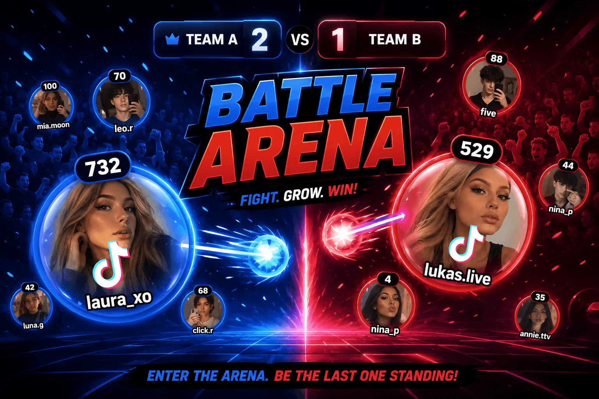
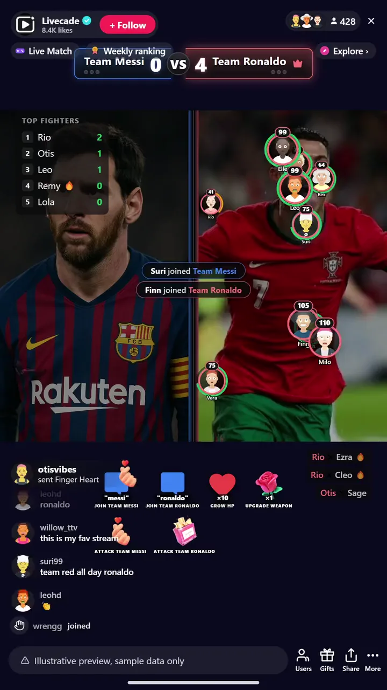

# Battle Arena - Interactive TikTok Live Game

> Two teams of viewers auto-brawl in a live arena.

Two teams of viewers brawl in a live arena. Every viewer who joins becomes a fighter flying their own profile picture, auto-battling the other side while the crowd gifts upgrades and watches their name climb the board.

**[Play Battle Arena on Livecade](https://livecade.io/games/battle-arena/?utm_source=github&utm_medium=readme&utm_campaign=battle-arena)** - runs as a single browser source in OBS, Streamlabs, or TikTok LIVE Studio. Nothing for viewers to install.

## How viewers play

Viewers take part with the actions TikTok already gives them: **comments**, **gifts**, **likes**. Every action below is rebindable, so you decide which interaction drives which effect.

| Action | What it does |
| --- | --- |
| **Join a side (per team)** | Adds the viewer as a fighter flying their profile picture on that team |
| **Grow my blob (HP)** | Pumps HP into the sender's own fighter so it survives longer |
| **Attack a whole team (per team)** | The sender's fighter unloads a barrage of random weapons on that team, one shot at a time. Bigger gift bursts mean longer barrages, and any shot can roll a rocket, cannonball, or nuke |

## How it works

### Pick a side and spawn

Viewers join Team A or Team B and a fighter carrying their profile picture drops into the arena to auto-battle the other side.

### Gifts arm your fighter

Gifts pump HP or load a barrage of random heavy weapons that your fighter unloads on the enemy team one shot at a time. Every gift is a lottery, and even a small one can roll a nuke.

### Win the round your way

Run first-to-kills, elimination, timed, or endless sandbox, best of N rounds. A live board tracks the top players the whole time.

## About the game

Battle Arena splits your chat into two teams and turns every viewer into a fighter. Type to join a side, then send gifts to spawn, grow HP, or unleash a barrage on the enemy team. Fighters roam their half and auto-battle in real time with a steady pistol.

### Gifts load a queue of heavy weapons

They fire one at a time: a shotgun blast, then a rocket, then maybe a full nuke. Hold the gift button and the barrage grows into a run of back-to-back explosions.

### Run it your way

Best-of rounds, first-to-kills, elimination and timed win modes, with live HP blobs, a top-players board and explosive impacts keeping the arena lively.

## What it looks like on stream

[Watch Battle Arena gameplay](https://cdn.livecade.io/games/battle-arena.mp4)

## What you can configure

- **Interface language** - Twelve languages for the on-screen chrome
- **Team names, colors, and backgrounds** - Brand each side with its own name, color, and image
- **Win mode** - First-to-kills, elimination, timed, or endless sandbox
- **Rounds and kills to win** - Best-of rounds and how many kills take a round
- **Round time limit** - Cap on how long a round can run
- **Max fighters per side** - How crowded each team can get
- **HP per grow** - How much HP each grow action adds
- **Practice fighters** - Auto-added bots when few viewers are playing so the arena stays lively
- **Sudden death and screen shake** - Overtime tie-breaks and heavy-weapon impact shake
- **Leaderboard** - Show a live top-players board, and how many entries
- **Background** - Transparent, a solid color, or your own image

## Languages

English, Spanish, Portuguese, French, German, Italian, Indonesian, Arabic, Turkish, Russian, Hindi, Romanian

## FAQ

<strong>How do viewers join Battle Arena?</strong>

Viewers pick a side from your TikTok Live chat and spawn a fighter flying their own profile picture. Both teams fill up as more people join, so any audience size works.

<strong>Do viewers need to send gifts to play?</strong>

No. Joining a team is free and comment-driven. Gifts add HP, weapon upgrades, and team-wide status attacks, which is what drives gifting during a match.

<strong>Can I change which triggers do what?</strong>

Yes. Every action is rebindable to a gift, comment, like, or follow with a minimum gift amount, so you decide exactly what spawns fighters, grows HP, or fires an attack.

<strong>How do I add Battle Arena to my TikTok Live?</strong>

Add one browser source URL to OBS or your streaming software and go live. There is no plugin to install and nothing for your viewers to download.

## Setup

1. [Create a Livecade account](https://app.livecade.io/register?utm_source=github&utm_medium=cta&utm_campaign=battle-arena)
2. Copy your overlay browser source URL
3. Paste it into OBS, Streamlabs, or TikTok LIVE Studio
4. Pick Battle Arena, set your triggers, and go live

Runs in the browser, so it works on Windows and macOS with nothing to download. [See all TikTok Live games](https://livecade.io/tiktok-live-games/?utm_source=github&utm_medium=readme&utm_campaign=battle-arena).

---

_This repository documents Battle Arena, a hosted interactive game by [Livecade](https://livecade.io/?utm_source=github&utm_medium=footer&utm_campaign=battle-arena). The game runs on Livecade's platform, so there is no source to install here._
